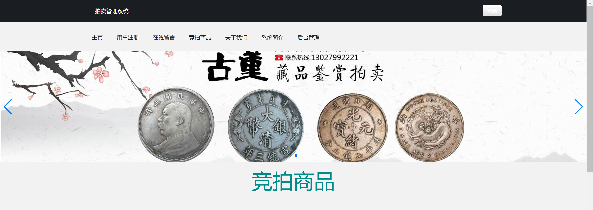
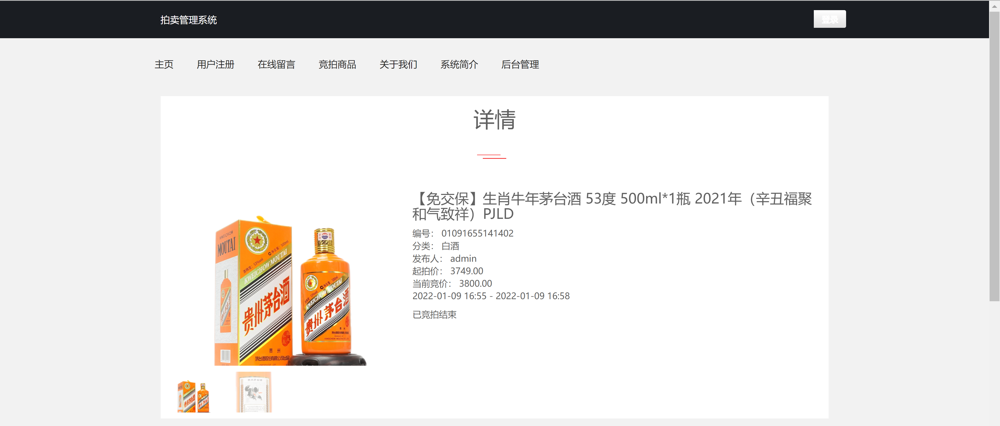
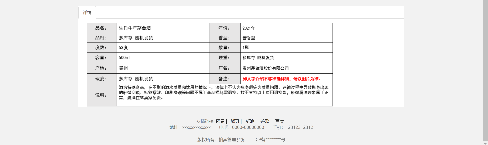
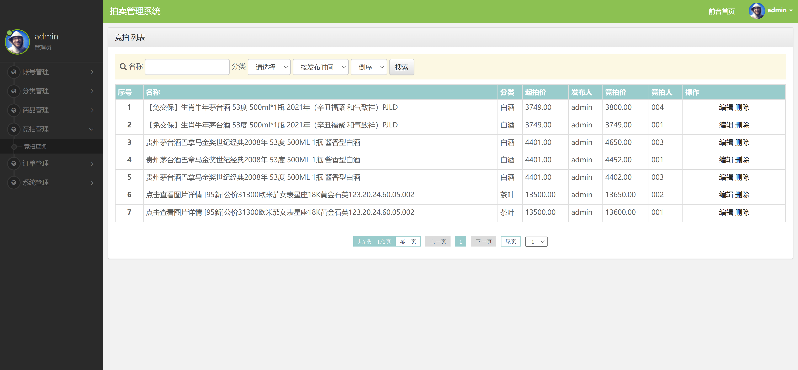
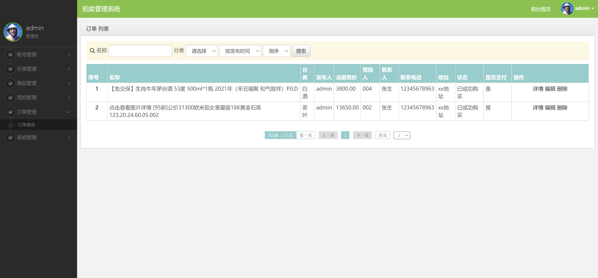

<h1 align="center">拍卖管理系统1</h1>

## 简介
拍卖管理系统：提供管理员和用户角色，支持登录验证、拍品管理、订单查询、商品详情浏览、在线竞拍和信息发布等功能，界面简洁，便于使用。    --计算机毕业设计源码；毕设源码；java毕业设计源码

## 联系方式

<h3 align="center">获取完整代码与数据库文件 + 微信：bysj5151 QQ: 86050149 QQ群: 783742310</h3>

<h3 align="center">可帮忙远程部署 包运行成功！提供远程部署、修改代码、设计文档指导、代码讲解等服务！</h3>

## 功能介绍（完整见运行截图）
管理员：基本功能包括登录和管理功能，如账号管理、分类管理、商品管理、竞拍管理、订单管理和系统管理。可以通过搜索功能按名称、分类和发布时间进行查询，还可对拍品进行编辑和删除。提供订单查询和管理功能，支持查看订单详情、编辑和删除操作。界面设计简洁明了，方便进行后台管理。

用户：基本功能包括登录、注册和查看商品详情。可以浏览可参与竞拍的商品，查看商品信息页面，获取详细描述和注意事项。能够查看历史订单和竞拍记录，通过主导航栏获取注册和留言功能以便参与竞拍活动。用户界面设计简洁，便于获取商品信息和进行竞拍。

## 运行截图

本代码来源于网络,仅供学习参考使用!

